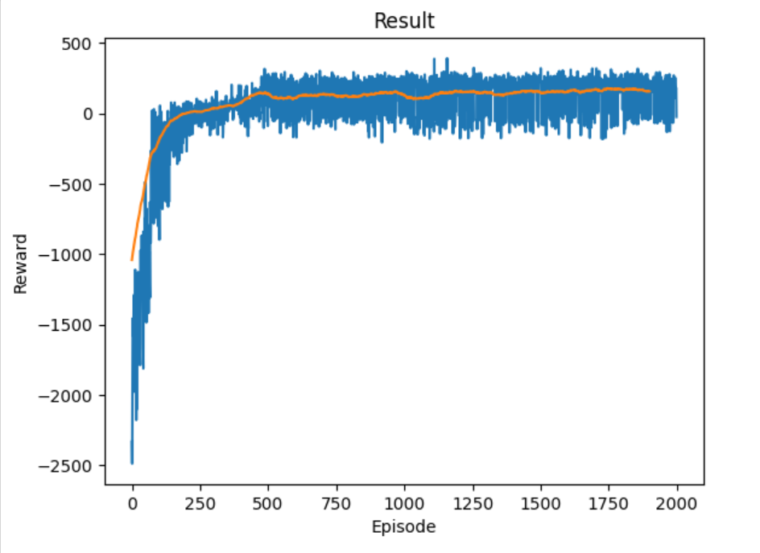

# 🚀 Proximal Policy Optimization (PPO) - Lunar Lander

## 🎯 Project Objective

Complete implementation of the **Proximal Policy Optimization (PPO)** reinforcement learning algorithm to train an agent to successfully land the **Lunar-Lander** spacecraft (Gymnasium environment).

The model learns to land smoothly between the two flags on the Moon.

---

## 💡 Key Technologies

This project demonstrates expertise in:

* **Reinforcement Learning (RL):** Mastery of a state-of-the-art Policy Gradient algorithm (PPO).
* **Actor-Critic Architecture:** Use of two distinct neural networks (Policy Network for action selection and Value Network for state evaluation) for improved learning stability.
* **Stability and Variance:** Utilization of **Clipping** to limit abrupt policy updates and **Generalized Advantage Estimation (GAE)** to reduce the variance of the reward signal.
* **Frameworks:** PyTorch, Gymnasium.

---

## 📊 Final Result (Video Demonstration)

The trained agent achieved an average reward of **+130** (the maximum score is +200), demonstrating an effective strategy for gliding towards the landing zone.

### Training Convergence Plot

The graph below illustrates the training process over 2000 episodes, showing a successful convergence of the average reward (orange line) into the positive zone, indicating consistent successful landings.

**Watch the agent in action:**

---

## 💻 Execution and Files

All the code, network class implementations, and training phases are contained within the following files:

* **`PPO_LunarLander.ipynb`**: Contains the PPO agent implementation, training with optimal hyperparameters, and the generation of the final video.
* **`./models/*.pth`**: Saved weights for the Policy Network (Actor) and Value Network (Critic).
* **`requirements.txt`**: List of project dependencies.

### ⚙️ How to Run
1.  Clone the repository.
2.  `pip install -r requirements.txt`
3.  Execute the **`PPO_LunarLander.ipynb`** notebook.
